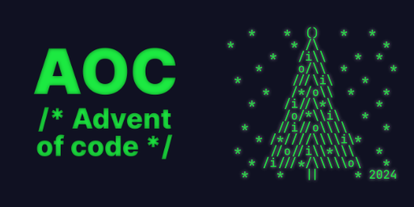

<div align="center">
  <h3>Advent of Code 2024</h3>
  
</div>

# Repository Structure
```
aoc/
│
├── src/
│   ├── day01/
│   ├── day02/
│   └── ...
│
├── README.md
└── .gitignore
```

## 🌟 My Advent of Code Profile

### Personal Information (TODO)

- **Programming Language**: Go
- **Year**: 2024
- **Total Stars Collected**: [Total Stars]
- **Favorite Challenge**: [Day X]


## 🏆 Tracking Progress (TODO)
<details>
<summary>My progress so far...</summary>

- [ ] Day 1
- [ ] Day 2
- [ ] Day 3
- [ ] Day 4
- [ ] Day 5
- [ ] Day 6
- [ ] Day 7
- [ ] Day 8
- [ ] Day 9
- [ ] Day 10
- [ ] Day 11
- [ ] Day 12
- [ ] Day 13
- [ ] Day 14
- [ ] Day 15
- [ ] Day 16
- [ ] Day 17
- [ ] Day 18
- [ ] Day 19
- [ ] Day 20
- [ ] Day 21
- [ ] Day 22
- [ ] Day 23
- [ ] Day 24
- [ ] Day 25

</details>

---

**Happy Coding! 🖥️🎄**
